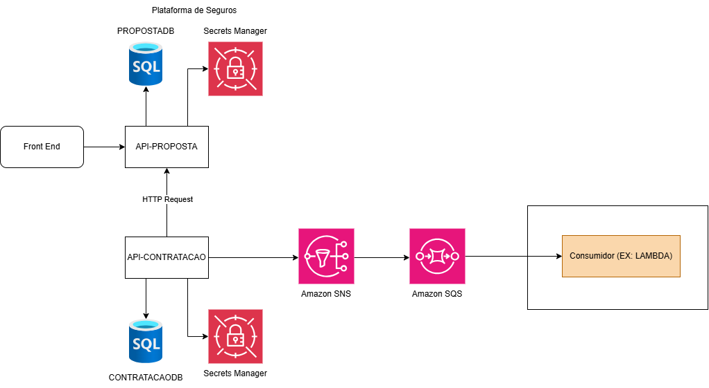

# Plataforma Seguros

Sistema de gerenciamento de seguros desenvolvido em .NET 8, composto por APIs para controle de propostas e contratação de seguros.

## 🛠️ Tecnologias Utilizadas

- **.NET 8** - Framework principal
- **Swashbuckle** - Documentação da API (Swagger/OpenAPI)
- **Dapper** - Mapeamento objeto-relacional
- **Docker** - Containerização
- **xUnit** - Framework de testes
- **SQL Server** - Banco de dados relacional
- **AWS** - Serviços em nuvem

## 🏗️ Arquitetura do Projeto

O projeto segue os princípios de **Arquitetura Hexagonal**, **Clean Architecture** e **Domain-Driven Design (DDD)**, organizado em camadas.

### Diagrama de Arquitetura



### Camadas da Aplicação

- **API**: Controllers, Middlewares e configuração da API REST
- **Application**: Use Cases, DTOs, Interfaces de serviços
- **Domain**: Entidades, Value Objects, Regras de negócio
- **Infrastructure**: Repositórios, Integrações externas, Contexto de dados
- **Test**: Testes unitários e de integração

## 🚀 Como executar o projeto

### Opção 1: Execução Local (.NET CLI)

#### 1. Clone o repositório

```bash
git clone https://github.com/sssamarasantos/plataforma-seguros.git
cd plataforma-seguros
```

#### 2. Navegue até o projeto da API

**API Proposta:**
```bash
cd api-proposta/src/SeguroProposta.Api
dotnet restore
dotnet run
```
A API estará disponível em: `http://localhost:5190`

**API Contratação:**
```bash
cd api-contratacao/src/SeguroContratacao.Api
dotnet restore
dotnet run
```
A API estará disponível em: `http://localhost:5156`

### Opção 2: Execução com Docker

#### Build da imagem Docker

```bash
cd api-contratacao
docker build -t plataforma-seguros-api:latest -f Dockerfile .
```

#### Executar o container

```bash
docker run -d -p 8080:8080 -p 8081:8081 \
  -e ASPNETCORE_ENVIRONMENT=Development \
  -e AWS_REGION=us-east-1 \
  --name seguro-contratacao \
  plataforma-seguros-api:latest
```

A API estará disponível em:
- HTTP: `http://localhost:8080`
- HTTPS: `http://localhost:8081`
- Swagger: `http://localhost:8080/swagger`

#### Parar e remover o container

```bash
docker stop seguro-contratacao
docker rm seguro-contratacao
```

## 🧪 Executar testes

O projeto inclui testes automatizados utilizando o framework **xUnit**.

- **Testes Unitários**: Validação de regras de negócio
- **Testes de Integração**: Validação de fluxos completos

### Executar todos os testes
```bash
cd api-proposta
dotnet test
```
ou
```bash
cd api-contratacao
dotnet test
```

### Executar testes com cobertura
```bash
dotnet test --collect:"XPlat Code Coverage"
```

### Executar testes de um projeto específico
```bash
cd src/SeguroProposta.Test
dotnet test
```
ou
```bash
cd src/SeguroContratacao.Test
dotnet test
```


## 📚 Documentação da API

### Swagger UI

Após executar as aplicações, acesse a documentação interativa:

- **API Proposta**: `http://localhost:5190/swagger`
- **API Contratação**: `http://localhost:5156/swagger`

A documentação é gerada automaticamente a partir dos comentários XML no código.

## 🔌 Como utilizar as APIs

### API Proposta (`http://localhost:5190`)

#### 1. Buscar todas as propostas

```http
GET http://localhost:5190/api/v1/Proposta
Accept: application/json
```

**Resposta esperada:** Lista de todas as propostas cadastradas.

---

#### 2. Buscar proposta por ID

```http
GET http://localhost:5190/api/v1/Proposta/1
Accept: application/json
```

**Parâmetros:**
- `id` (path): ID da proposta

**Resposta esperada:** Dados da proposta específica.

---

#### 3. Criar nova proposta

```http
POST http://localhost:5190/api/v1/Proposta
Content-Type: application/json
Body:
{
  "titulo": "SEGURO TESTE",
  "descricao": "SEGURO TESTE DESCRICAO",
  "valorPremio": 100,
  "valorCobertura": 150,
  "emailContratante": "teste@email.com"
}
```

**Resposta esperada:** Proposta criada com sucesso.

---

#### 4. Alterar status da proposta

```http
PATCH http://localhost:5190/api/v1/Proposta
Content-Type: application/json
Body:
{
  "id": 1,
  "status": "EmAnalise"
}
```

**Resposta esperada:** Status da proposta atualizado.

---

### API Contratação (`http://localhost:5156`)

#### 1. Criar contratação

```http
POST http://localhost:5156/api/v1/contratacao
Accept: application/json
Content-Type: application/json
Body:
{
  "idProposta": 1,
  "valorPremioFinal": 1500.00,
  "valorCoberturaFinal": 2000.00
}
```

**Resposta esperada:** Contratação criada com sucesso.

---

### Exemplos com cURL

#### Criar uma proposta

```bash
curl -X POST http://localhost:5190/api/v1/proposta \
  -H "Content-Type: application/json" \
  -d '{
  "titulo": "SEGURO TESTE",
  "descricao": "SEGURO TESTE DESCRICAO",
  "valorPremio": 100,
  "valorCobertura": 150,
  "emailContratante": "teste@email.com"
}'
```

#### Buscar proposta por ID

```bash
curl -X GET http://localhost:5190/api/v1/proposta/1 \
  -H "Accept: application/json"
```

#### Criar contratação

```bash
curl -X POST http://localhost:5156/api/v1/contratacao \
  -H "Content-Type: application/json" \
  -H "Accept: application/json" \
  -d '{
  "idProposta": 1,
  "valorPremioFinal": 1500.00,
  "valorCoberturaFinal": 2000.00
}'
```

---

### Fluxo de Uso Recomendado

1. **Criar Proposta** → Use a API Proposta para criar uma nova proposta de seguro
2. **Consultar Proposta** → Verifique os dados da proposta criada
3. **Aprovar Proposta** → Altere o status da proposta para "Aprovada"
4. **Criar Contratação** → Use a API Contratação para efetivar o seguro

---
